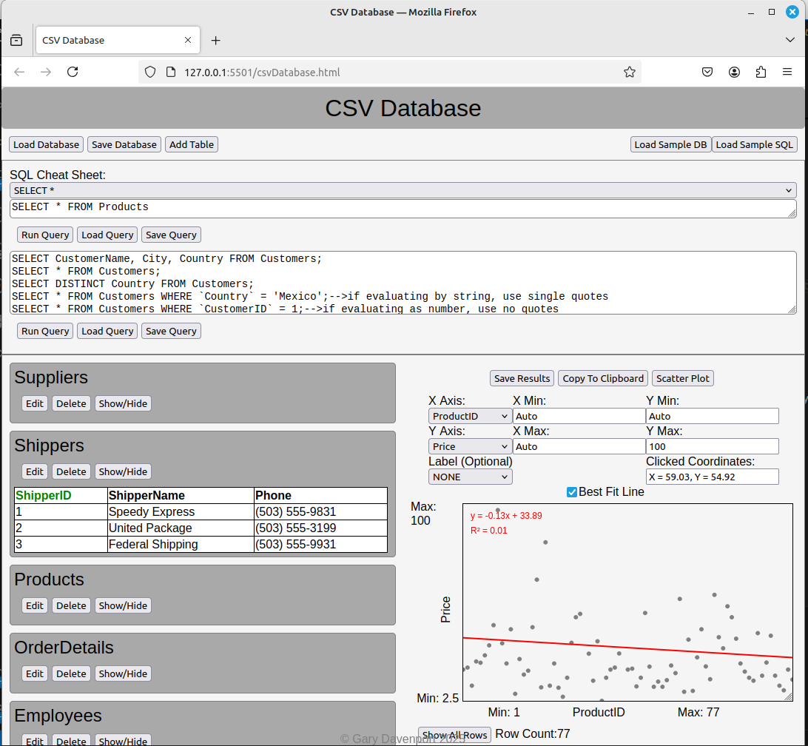

# csv-database
I made this so because I could not obtain a database at work.  It works with CSV files and runs in a broswer.  It is just an html file.  You can add csv files, mark fields as number vs string, do queries, plot and fit lines.  I am working on doing multivariable linear regression.  After that I think I will add some error checking.  Note the syntax is a little different then standard SQL but there are samples you have to follow.

-Conceptually what you have to know about this database is that it takes csv and parses them into an array of arrays.  In the arrays, every element is a string, there are no numbers.  So 2 is stored as '2'.  That is because it is a representation of CSV, and CSV is made of up strings - it is a text file.  Some people say, if its quoted its a string, if not maybe a number.  Not me.  For this project everything is stored as a string.

You can mark your headers when loading in CSV by clicking on the header.  The header will turn green to indicate a number, but its still stored as a string in the array.  However, when you go to do comparisons, computations, etc, it will get "Numbered" to a number ie. Number('2') = 2.

The WHERE and HAVING clauses require backticks to indicate the field will be replaced by its value.  Its value should be in single quotes for strings or no quotes for numbers.  What is happening, is the info is being passed to an "eval" function.  (No not the javascript eval but the safer on the fly function generator where a function is built on the fly for the computation.  Look in the file for the function called myEval if you want to see.

Look at the examples in the sample sql statements or copy from the drop down cheat sheet and follow those examples.  Also, there is no error checking so you may find yourself hitting control shift I and watching the console for lots of logging statements.  If you have an issue email me and I will try to help.

The nice thing is once you have your SQL statements working you can save them.

My overall plan is to use it for a while, find out the most important error checking mechanisms to place, get the multivariable regression working and call it a day.  Because actually that is quite a lot of functionality and a lot can be done.  This is just a quick upload and I will put more supporting documents and pieces of code in the repository.

For now, I want to get the file uploaded in case my computer dies so it is in a second locaction and maybe I can get some feedback from users.

Please contact me through github for any suggestions or if you are willing to help.

Also, I haven't mentioned, but I had to build a limited SQL parser in order to do this project.  In fact is is sort of arranged in a forward thinking manner.  The program first parses the SQL statements into tokens.  Then the tokens are passed to a library which returns tables.  However, what a table is could be about any data structure as far as the parser is concerned.

In other words, there is a parser function library, and a process functions library that proceses the tokens.  If I ever want to use a different data structure or something else instead of array of arrays, the code is set up for that.

The current structure of a table is a javascript object.  The object has headers which is a 1d array of headers.  data, an array of arrays corresponding to csv cells.  dataTypes, similar to headers, only they contain the strings STRING or NUMBER.  Also the object has a name.  The database has a property called tables.  Each tables name identifies the table.  I plan to upload a visual example.

For now, this is my initial commit.

